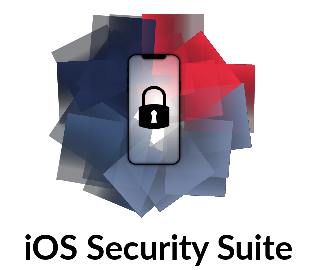

### by [@_r3ggi](https://twitter.com/_r3ggi)

## ISS Description
🌏 iOS Security Suite is an advanced and easy-to-use platform security & anti-tampering library written in pure Swift! If you are developing for iOS and you want to protect your app according to the OWASP [MASVS](https://github.com/OWASP/owasp-masvs) standard, chapter v8, then this library could save you a lot of time. 🚀

What ISS detects:

* Jailbreak (even the iOS 11+ with brand new indicators! 🔥)
* Attached debugger 👨🏻‍🚀
* If an app was run in an emulator 👽
* Common reverse engineering tools running on the device 🔭

## Setup
There are 4 ways you can start using IOSSecuritySuite

### 1. Add source
Add `IOSSecuritySuite/*.swift` files to your project

### 2. Setup with CocoaPods
`pod 'IOSSecuritySuite'`

### 3. Setup with Carthage
`github "securing/IOSSecuritySuite"`

### 4. Setup with Swift Package Manager
```swift
.package(url: "https://github.com/securing/IOSSecuritySuite.git", from: "1.5.0")
```

### Update Info.plist
After adding ISS to your project, you will also need to update your main Info.plist. There is a check in jailbreak detection module that uses ```canOpenURL(_:)``` method and [requires](https://developer.apple.com/documentation/uikit/uiapplication/1622952-canopenurl) specifying URLs that will be queried.

```xml
<key>LSApplicationQueriesSchemes</key>
<array>
    <string>cydia</string>
    <string>undecimus</string>
    <string>sileo</string>
    <string>zbra</string>
    <string>filza</string>
    <string>activator</string>
</array>
```

## How to use

### Jailbreak detector module

* **The simplest method** returns True/False if you just want to know if the device is jailbroken or jailed

```Swift
if IOSSecuritySuite.amIJailbroken() {
	print("This device is jailbroken")
} else {
	print("This device is not jailbroken")
}
```

* **Verbose**, if you also want to know what indicators were identified

```Swift
let jailbreakStatus = IOSSecuritySuite.amIJailbrokenWithFailMessage()
if jailbreakStatus.jailbroken {
	print("This device is jailbroken")
	print("Because: \(jailbreakStatus.failMessage)")
} else {
	print("This device is not jailbroken")
}
```
The failMessage is a String containing comma-separated indicators as shown on the example below:
`Cydia URL scheme detected, Suspicious file exists: /Library/MobileSubstrate/MobileSubstrate.dylib, Fork was able to create a new process`

* **Verbose & filterable**, if you also want to for example identify devices that were jailbroken in the past, but now are jailed

```Swift
let jailbreakStatus = IOSSecuritySuite.amIJailbrokenWithFailedChecks()
if jailbreakStatus.jailbroken {
   if (jailbreakStatus.failedChecks.contains { $0.check == .existenceOfSuspiciousFiles }) && (jailbreakStatus.failedChecks.contains { $0.check == .suspiciousFilesCanBeOpened }) {
         print("This is real jailbroken device")
   }
}
```

### Debugger detector module
```Swift
let amIDebugged: Bool = IOSSecuritySuite.amIDebugged()
```

### Deny debugger at all
```Swift
IOSSecuritySuite.denyDebugger()
```

### Emulator detector module
```Swift
let runInEmulator: Bool = IOSSecuritySuite.amIRunInEmulator()
```

### Reverse engineering tools detector module
```Swift
let amIReverseEngineered: Bool = IOSSecuritySuite.amIReverseEngineered()
```

### System proxy detector module
```Swift
let amIProxied: Bool = IOSSecuritySuite.amIProxied()
```

## Experimental features

### Runtime hook detector module
```Swift
let amIRuntimeHooked: Bool = amIRuntimeHook(dyldWhiteList: dylds, detectionClass: SomeClass.self, selector: #selector(SomeClass.someFunction), isClassMethod: false)
```
### Symbol hook deny module
```Swift
// If we want to deny symbol hook of Swift function, we have to pass mangled name of that function
denySymbolHook("$s10Foundation5NSLogyySS_s7CVarArg_pdtF")   // denying hooking for the NSLog function
NSLog("Hello Symbol Hook")
     
denySymbolHook("abort") 
abort()
```

### MSHook detector module
```Swift
// Function declaration
func someFunction(takes: Int) -> Bool {
	return false
} 

// Defining FunctionType : @convention(thin) indicates a “thin” function reference, which uses the Swift calling convention with no special “self” or “context” parameters.
typealias FunctionType = @convention(thin) (Int) -> (Bool)

// Getting pointer address of function we want to verify
func getSwiftFunctionAddr(_ function: @escaping FunctionType) -> UnsafeMutableRawPointer {
	return unsafeBitCast(function, to: UnsafeMutableRawPointer.self)
}

let funcAddr = getSwiftFunctionAddr(someFunction)
let amIMSHooked = IOSSecuritySuite.amIMSHooked(funcAddr)
```

### MSHook deny module
```Swift
// Function declaration
func denyDebugger(value: Int) {
}

// Defining FunctionType : @convention(thin) indicates a “thin” function reference, which uses the Swift calling convention with no special “self” or “context” parameters.
typealias FunctionType = @convention(thin) (Int)->()

// Getting original function address
let funcDenyDebugger: FunctionType = denyDebugger 
let funcAddr = unsafeBitCast(funcDenyDebugger, to: UnsafeMutableRawPointer.self)


if let originalDenyDebugger = denyMSHook(funcAddr) {
// Call the original function with 1337 as Int argument
     unsafeBitCast(originalDenyDebugger, to: FunctionType.self)(1337)
 } else {
     denyDebugger()
 }
```

### File integrity verifier module

```Swift
// Determine if application has been tampered with 
if IOSSecuritySuite.amITampered([.bundleID("biz.securing.FrameworkClientApp"),
    .mobileProvision("2976c70b56e9ae1e2c8e8b231bf6b0cff12bbbd0a593f21846d9a004dd181be3"),
    .machO("IOSSecuritySuite", "6d8d460b9a4ee6c0f378e30f137cebaf2ce12bf31a2eef3729c36889158aa7fc")]).result {
    print("I have been Tampered.")
}
else {
    print("I have not been Tampered.")
}

// Manually verify SHA256 hash value of a loaded dylib
if let hashValue = IOSSecuritySuite.getMachOFileHashValue(.custom("IOSSecuritySuite")), hashValue == "6d8d460b9a4ee6c0f378e30f137cebaf2ce12bf31a2eef3729c36889158aa7fc" {
    print("I have not been Tampered.")
}
else {
    print("I have been Tampered.")
}
 
// Check SHA256 hash value of the main executable
// Tip: Your application may retrieve this value from the server
if let hashValue = IOSSecuritySuite.getMachOFileHashValue(.default), hashValue == "your-application-executable-hash-value" {
    print("I have not been Tampered.")
}
else {
    print("I have been Tampered.")
}
```

### Breakpoint detection module

```Swift
func denyDebugger() {
    // add a breakpoint at here to test
}
     
typealias FunctionType = @convention(thin) ()->()
let func_denyDebugger: FunctionType = denyDebugger   // `: FunctionType` is a must
let func_addr = unsafeBitCast(func_denyDebugger, to: UnsafeMutableRawPointer.self)
let hasBreakpoint = IOSSecuritySuite.hasBreakpointAt(func_addr, functionSize: nil)

if hasBreakpoint {
    print("Breakpoint found in the specified function")
} else {
    print("Breakpoint not found in the specified function")
}
```

## Security considerations
Before using this and other platform security checkers, you have to understand that:

* Including this tool in your project is not the only thing you should do in order to improve your app security! You can read a general mobile security whitepaper [here](https://www.securing.biz/en/mobile-application-security-best-practices/index.html).
* Detecting if a device is jailbroken is done locally on the device. It means that every jailbreak detector may be bypassed (even this)! 
* Swift code is considered to be harder to manipulate dynamically than Objective-C. Since this library was written in pure Swift, the IOSSecuritySuite methods shouldn't be exposed to Objective-C runtime (which makes it more difficult to bypass ✅). You have to know that attacker is still able to MSHookFunction/MSFindSymbol Swift symbols and dynamically change Swift code execution flow.
* It's also a good idea to obfuscate the whole project code, including this library. See [Swiftshield](https://github.com/rockbruno/swiftshield)

## Contribution ❤️
Yes, please! If you have a better idea or you just want to improve this project, please text me on [Twitter](https://twitter.com/_r3ggi) or [Linkedin](https://www.linkedin.com/in/wojciech-regula/). Pull requests are more than welcome!

### Special thanks: 👏🏻

* [kubajakowski](https://github.com/kubajakowski) for pointing out the problem with ```canOpenURL(_:)``` method
* [olbartek](https://github.com/olbartek) for code review and pull request 
* [benbahrenburg](https://github.com/benbahrenburg) for various ISS improvements
* [fotiDim](https://github.com/fotiDim) for adding new file paths to check
* [gcharita](https://github.com/gcharita) for adding the Swift Package Manager support
* [rynaardb](https://github.com/rynaardb) for creating the `amIJailbrokenWithFailedChecks()` method
* [undeaDD](https://github.com/undeaDD) for various ISS improvements
* [fnxpt](https://github.com/fnxpt) for adding multiple JB detections
* [TannerJin](https://github.com/TannerJin) for MSHook, RuntimeHook and SymbolHook modules
* [NikoXu](https://github.com/NikoXu) for adding file integrity module
* [hellpf](https://github.com/hellpf) for fixing a dangling socket problem

## TODO

* [ ] Research Installer5 and Zebra Package Manager detection ( Cydia Alternatives )

## License
See the LICENSE file.

## References
While creating this tool I used:

* 🔗 https://github.com/TheSwiftyCoder/JailBreak-Detection
* 🔗 https://github.com/abhinashjain/jailbreakdetection 
* 🔗 https://gist.github.com/ddrccw/8412847
* 🔗 https://gist.github.com/bugaevc/4307eaf045e4b4264d8e395b5878a63b
* 📚 "iOS Application Security" by David Thiel
